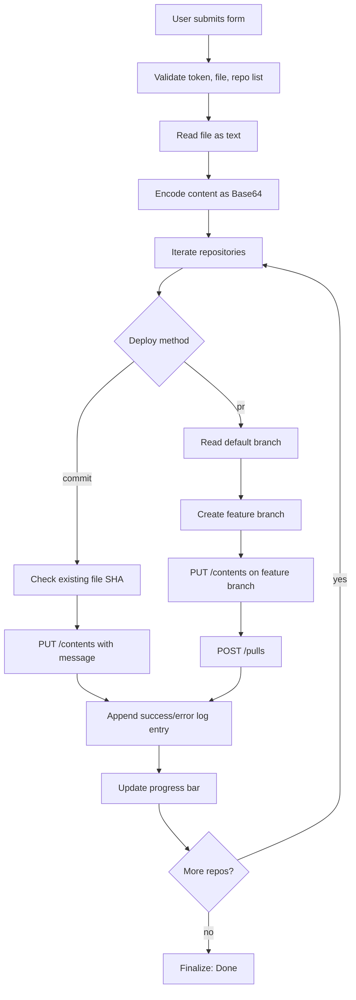

# GitHub File Deployer

A browser-based JavaScript deployment utility that securely pushes a single file to multiple GitHub repositories using direct commits or automated pull-request workflows.

[](LICENSE)
[](#5-getting-started)
[](#4-tech-stack--architecture)
[](#4-tech-stack--architecture)

> [!IMPORTANT]
> This tool requires a GitHub Personal Access Token with repository write permissions (`repo` scope for classic PATs or equivalent fine-grained permissions).

---

# Table of Contents

- [Table of Contents](#table-of-contents)
- [Features](#features)
- [Tech Stack \/ Architecture](#tech-stack--architecture)
- [Getting Started](#getting-started)
- [Testing](#testing)
- [Deployment](#deployment)
- [Usage](#usage)
- [Configuration](#configuration)
- [License](#license)
- [Contacts & Community Support](#ontacts--community-support)

---

# Features

- Multi-target file deployment to many repositories in a single execution pass.
- Two delivery strategies:
  - Direct commit to repository default branch (create or update file).
  - Pull request flow with branch creation and PR opening.
- GitHub API orchestration through native `fetch` calls (no backend required).
- Automatic repository input normalization:
  - Accepts `owner/repo`.
  - Accepts `https://github.com/owner/repo`.
- Co-author trailer generation for bot identities via selectable presets.
- Persistent form state via `localStorage`:
  - Token, repository list, commit message/body, deployment method, PR metadata.
- Drag-and-drop file ingestion with automatic commit message bootstrapping from filename.
- Visual real-time progress with per-repository success/failure status logs.
- Lightweight stack: plain HTML, CSS, and ES modules (no bundler, no runtime server dependency).
- Compatible with static hosting and local `file://`/simple HTTP serving workflows.

> [!TIP]
> The project is ideal for docs, policy files, templates, CI snippets, and other “same-file-across-many-repos” maintenance tasks.

---

# Tech Stack & Architecture

## Core Stack

- **Language**: JavaScript (ES modules).
- **Runtime**: Modern browser environment.
- **UI**: Semantic HTML + vanilla CSS.
- **API Integration**: GitHub REST API (`application/vnd.github+json`).
- **Data Persistence**: Browser `localStorage`.

## Project Structure

```text
.
├── bots.js                # Known bot accounts used for co-author trailers
├── CODE_OF_CONDUCT.md     # Community standards
├── CONTRIBUTING.md        # Contribution process and quality expectations
├── index.html             # Main UI layout and form controls
├── LICENSE                # MIT license
├── README.md              # Project documentation
├── script.js              # App logic, API calls, state persistence, workflow control
└── style.css              # Visual styling and interaction states
```

## Key Design Decisions

- **Backendless architecture**: All logic executes in the browser, reducing infrastructure overhead and simplifying deployment.
- **Idempotent file operation semantics**: `PUT /contents/{path}` is used for both creation and update based on existing file SHA discovery.
- **Workflow bifurcation**: Commit and PR flows are separated into dedicated async routines for clarity and maintainability.
- **Optimistic UX with granular status telemetry**: Each repository operation emits scoped success/error records instead of a monolithic result.
- **Minimal dependency surface**: No external NPM modules, resulting in low supply-chain risk and simple onboarding.

## Logging / Status Pipeline (Mermaid)



> [!NOTE]
> Although this is not a standalone logging library, the status logging subsystem is designed as an event-style feedback stream that tracks each repository operation independently.

---

# Getting Started

## Prerequisites

- A modern browser (Chromium, Firefox, Edge, Safari latest stable).
- GitHub Personal Access Token:
  - Classic PAT: `repo` scope.
  - Fine-grained PAT: repository contents write + pull requests write.
- Optional: local static file server for consistent module loading behavior.

## Installation

```bash
git clone https://github.com/<your-org-or-user>/Automated-Task-Runner-JS.git
cd Automated-Task-Runner-JS
```

Start with any static server (example options):

```bash
# Python 3
python3 -m http.server 8080

# Node (if installed globally)
npx serve .
```

Then open the app:

```text
http://localhost:8080
```

> [!WARNING]
> Never commit or share your PAT. Treat it as a secret credential.

---

# Testing

This repository currently has no formal test harness (unit/integration framework), but you can execute deterministic syntax and smoke validations.

## Syntax Checks

```bash
node --check script.js
node --check bots.js
```

## Manual Integration Checks

1. Start local server and open the UI.
2. Enter PAT, repository list, and choose a file.
3. Run **Direct commit** mode against a test repository.
4. Run **Pull request** mode and verify branch + PR creation.
5. Confirm logs, progress indicator, and final status output.

## Linting

No ESLint/Prettier configuration is currently included.

> [!CAUTION]
> If your file contains non-UTF-8 characters, validate commit output in GitHub after deployment.

---

# Deployment

## Production Deployment Model

This project is static and can be deployed to any static hosting platform:

- GitHub Pages
- Netlify
- Vercel static output
- Cloudflare Pages
- Internal Nginx/Apache static hosting

## Build Step

No compilation pipeline is required. Deploy repository files as-is.

## Suggested CI/CD Pipeline

1. Checkout repository.
2. Run syntax checks.
3. Publish static assets.

Example (GitHub Actions concept):

```yaml
name: deploy-static
on:
  push:
    branches: [main]

jobs:
  validate-and-deploy:
    runs-on: ubuntu-latest
    steps:
      - uses: actions/checkout@v4
      - uses: actions/setup-node@v4
        with:
          node-version: '20'
      - run: node --check script.js
      - run: node --check bots.js
      # Add your static-host deployment action here
```

> [!IMPORTANT]
> Because authentication is entered client-side, ensure your hosting origin is trusted and served over HTTPS.

---

# Usage

## Minimal Direct Commit Flow

```text
1) Open the application.
2) Paste GitHub token.
3) Add repositories (one per line).
4) Select a file.
5) Keep Deploy Method = Direct commit.
6) Click Deploy.
```

## Pull Request Flow with Custom Metadata

```text
1) Select Deploy Method = Pull request.
2) Optionally set branch name.
3) Provide PR title and body.
4) Submit to create one PR per repository.
```

## API Behavior Example (Equivalent Programmatic Intent)

```js
// Pseudocode reflecting internal behavior from script.js
const headers = {
  Authorization: `Bearer ${token}`,
  Accept: 'application/vnd.github+json',
  'X-GitHub-Api-Version': '2022-11-28'
};

// 1) Read file state to detect create vs update path
const get = await fetch(
  `https://api.github.com/repos/${owner}/${repo}/contents/${encodeURIComponent(fileName)}`,
  { headers }
);

let sha;
if (get.ok) {
  const data = await get.json();
  sha = data.sha; // existing file path
}

// 2) Write file content
await fetch(
  `https://api.github.com/repos/${owner}/${repo}/contents/${encodeURIComponent(fileName)}`,
  {
    method: 'PUT',
    headers,
    body: JSON.stringify({
      message: fullMessage,
      content: base64Content,
      ...(sha ? { sha } : {})
    })
  }
);
```

---

# Configuration

## Runtime Input Configuration

- **Personal access token**: required credential for GitHub API.
- **Target repositories**: newline-separated repository identifiers.
- **File to deploy**: uploaded local file; filename becomes destination path.
- **Deploy method**: `commit` or `pr`.
- **Commit message**: summary line for commit.
- **Extended description**: optional commit body block.
- **Co-authors**: optional Git trailer entries from preloaded bot list.
- **PR branch/title/body**: optional values used only in PR mode.

## Local Storage Keys

The app persists state under these keys:

- `gfd_repoList`
- `gfd_apiToken`
- `gfd_commitMessage`
- `gfd_extendedDesc`
- `gfd_selectedBots`
- `gfd_deployMethod`
- `gfd_prBranch`
- `gfd_prTitle`
- `gfd_prBody`

## Environment Variables

No `.env` or server-side environment variable system is required by default.

## Startup Flags / Config Files

- No CLI startup flags.
- No dedicated JSON/YAML config file.
- Configuration is user-provided at runtime via UI + browser persistence.

> [!NOTE]
> If you need enterprise policy controls, introduce a backend token broker and remove direct PAT handling from the browser.

---

# License

This project is licensed under the **MIT License**. See [LICENSE](LICENSE) for full terms.

---

# Contacts & Community Support

## Support the Project

[](https://www.patreon.com/OstinFCT)
[](https://ko-fi.com/fctostin)
[](https://boosty.to/ostinfct)
[](https://www.youtube.com/@FCT-Ostin)
[](https://t.me/FCTostin)

If you find this tool useful, consider leaving a star on GitHub or supporting the author directly.
